# Topography Editor

[](https://www.gnu.org/licenses/gpl-3.0)
[](https://nodejs.org/)
[](https://vitejs.dev/)

The photoshop of topography, basically. This tool allows users to upload contour line data through GeoJSON files, then apply visual modifications, and export the results.

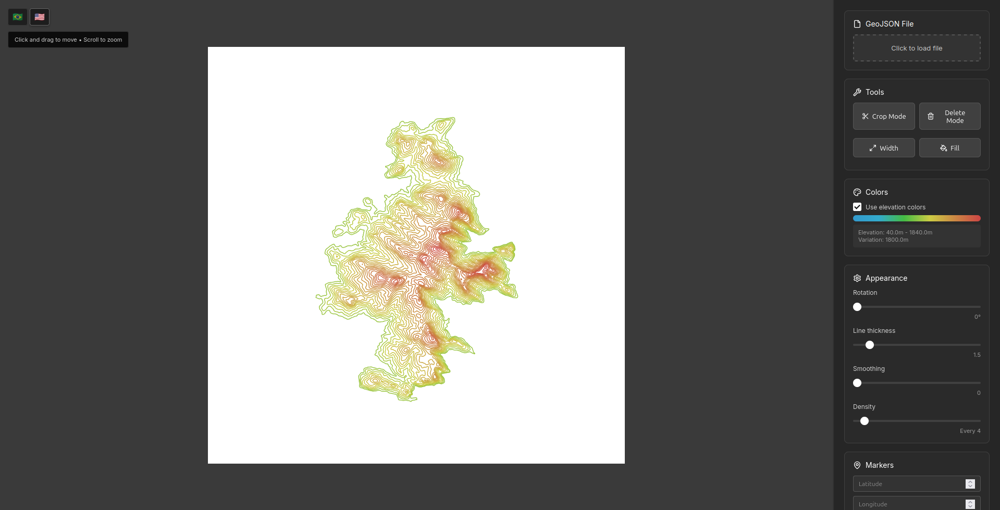

## Features

#### Crop Tool

- Select contour lines to create custom boundaries
- Remove unwanted areas from your topographic data

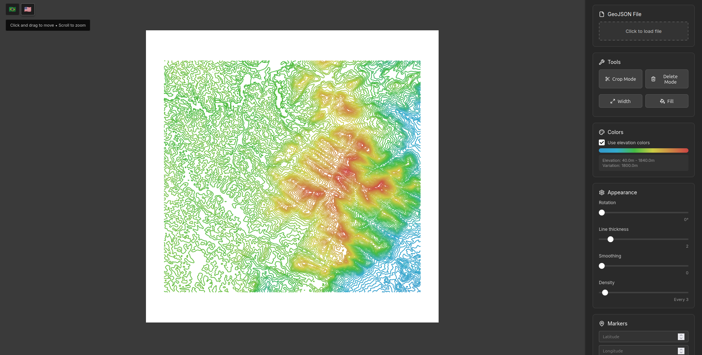
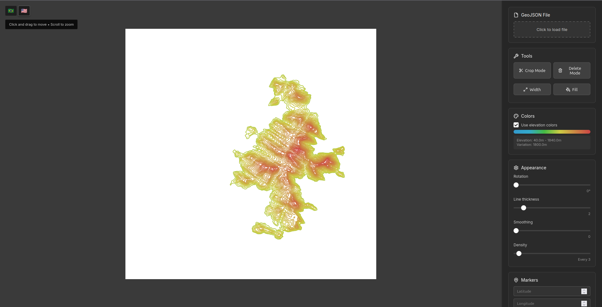

#### Delete Tool

- Remove individual contour lines by clicking
- Clean up unwanted or erroneous data points

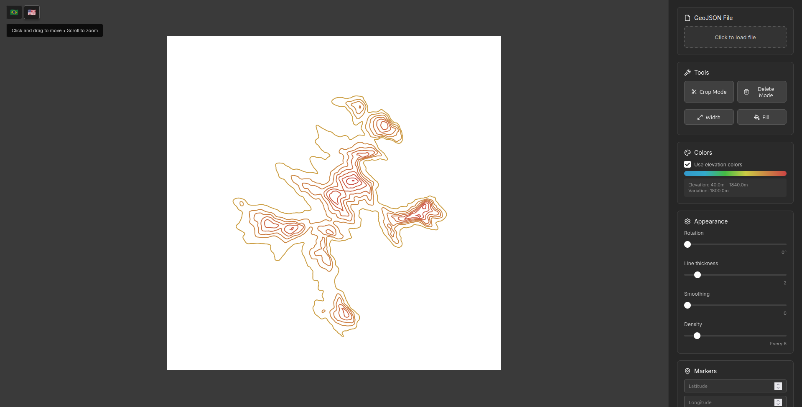
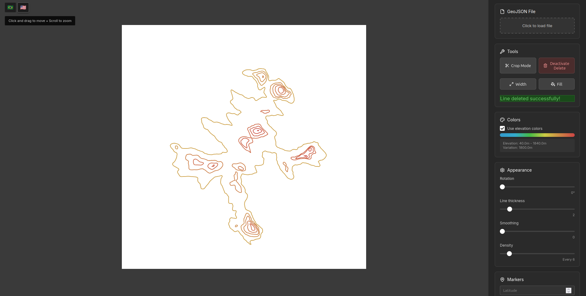

#### Line Width Editor

- Modify individual line widths
- Apply consistent styling to elevation groups
- Visual feedback during editing

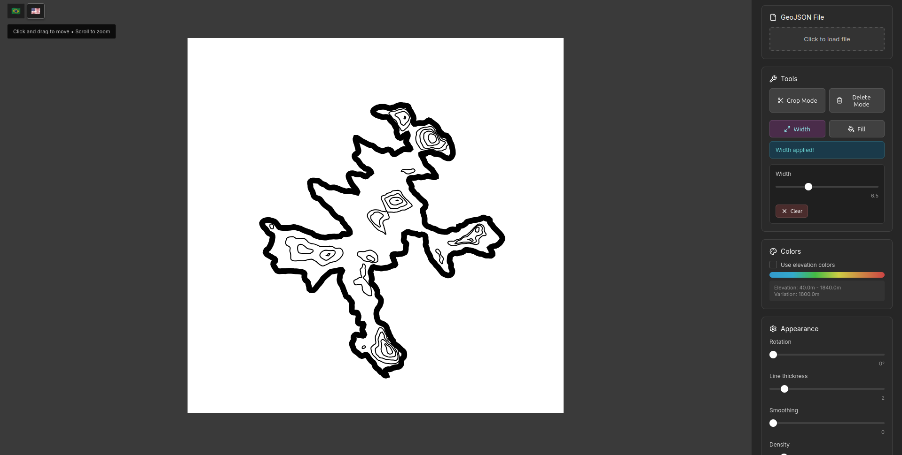

#### Fill Tool

- Create filled areas between contour lines
- Adjustable opacity and gradient options
- Perfect for highlighting elevation zones

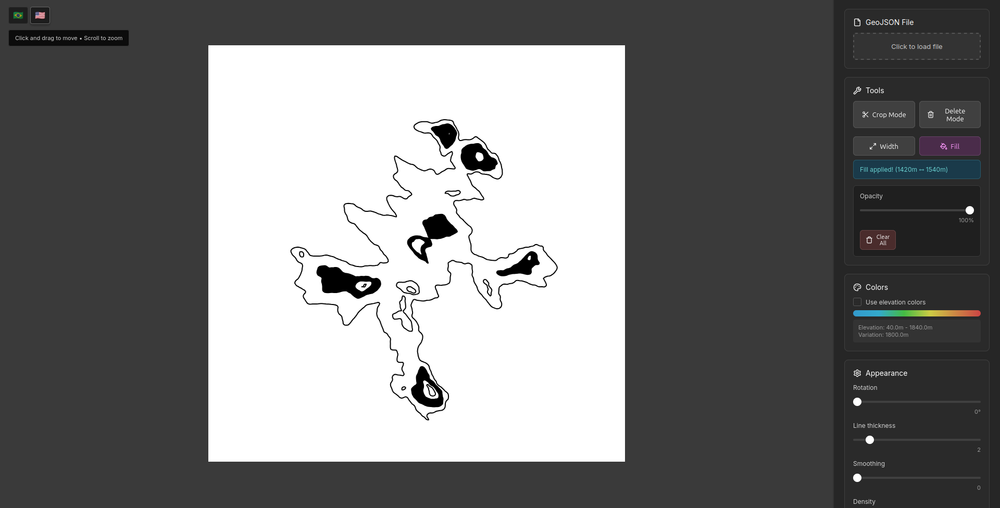

#### Smoothing

- Apply smoothing algorithms to reduce line complexity
- Adjustable smoothing intensity from 0-100%
- Helps create cleaner, more visually appealing contour lines

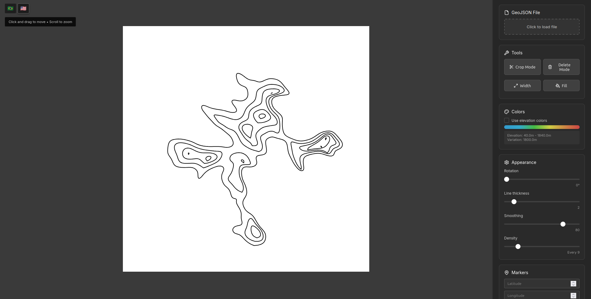

#### Density Control

- Control how many contour lines are displayed
- Reduce density for better performance with large datasets
- Show every nth line or display all lines
- Helpful for managing visual complexity and rendering speed

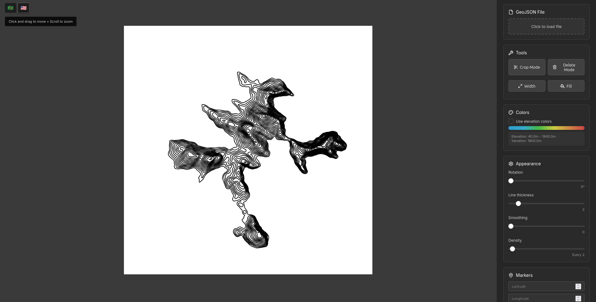
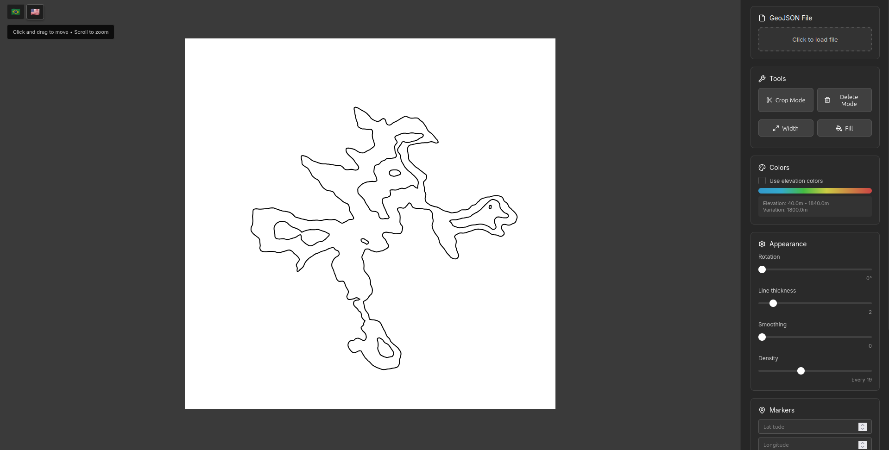

### Marker

- **Custom Markers**: Add points at specific coordinates
- **Size Control**: Adjustable marker sizes
- **Coordinate Input**: Precise latitude/longitude positioning

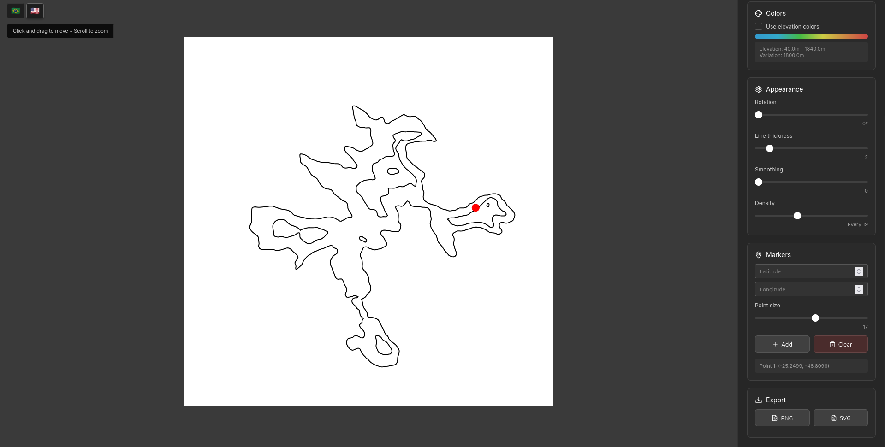

### Export Options

- **PNG Export**: High-quality raster images
- **SVG Export**: Vector graphics for professional use
- Maintains all visual modifications and styling

## Installation

1. **Clone the repository**

   ```bash
   git clone https://github.com/yourusername/topography-editor.git
   cd topography-editor
   ```

2. **Install dependencies**

   ```bash
   yarn install
   ```

3. **Start development server**

   ```bash
   yarn dev
   ```

## Usage

### Getting Started

**Upload GeoJSON File**

- Get a GeoJSON file from an external tool (I suggest [this one](https://mapscaping.com/free-online-elevation-contour-generator/))
- Click on the "Click to load file"
- Select a `.geojson` or `.json` file containing contour line data
- Wait for processing to complete

### GeoJSON Format Requirements

Your GeoJSON file should contain:

- LineString or MultiLineString geometries
- Elevation data in properties
- Valid coordinate arrays in [longitude, latitude] format

Example structure:

```json
{
  "type": "FeatureCollection",
  "features": [
    {
      "type": "Feature",
      "geometry": {
        "type": "LineString",
        "coordinates": [[-122.4, 37.8], [-122.3, 37.9]]
      },
      "properties": {
        "elevation": 100
      }
    }
  ]
}
```

## Contributing

1. Fork the repository
2. Create a feature branch
3. Commit your changes
4. Push to the branch
5. Open a Pull Request

### Development Guidelines

- Follow ES6+ standards
- Use modular architecture
- Add comments for complex algorithms
- Test with multiple GeoJSON files
- Update translations for new descriptions

## Performance Considerations

- Large GeoJSON files (>50MB) are rejected for performance
- Line density can be reduced for better performance with large datasets
- Cropping is terribly slow
- Smoothing algorithms may slow down rendering on complex data
